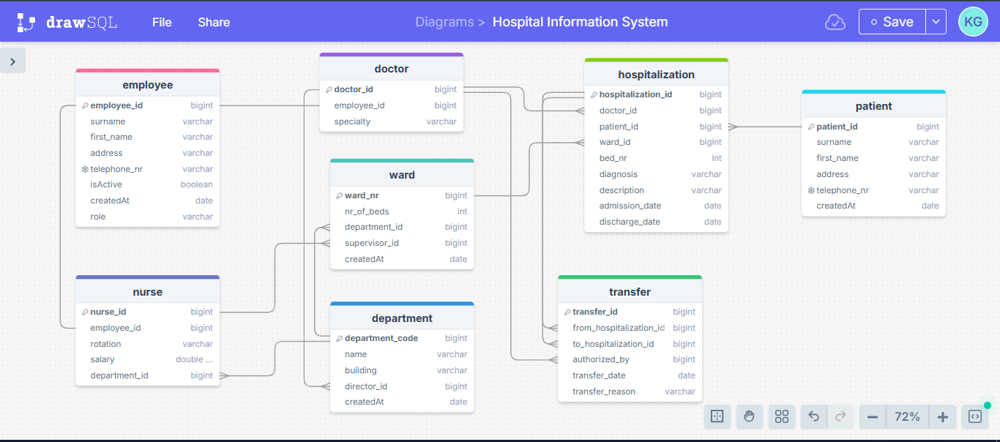

# 🏥 Hospital Information System

This project models a **Hospital Information System** with focus on **database design, normalization**, and **Java integration using JDBC**. It simulates real-world hospital operations involving employees, departments, wards, and patients.

---

## 💼 Project Overview

This lab project includes:

- Designing an ER diagram based on hospital structure
- Normalizing the database schema up to 3NF
- Implementing the schema in PostgreSQL with relationships and constraints
- Connecting a Java application to the database using JDBC
- Performing CRUD operations on the Patient entity

---

## 🛠️ Key Features

- 🧱 **Relational Database Design**
    - ER model and schema normalization
    - Primary and foreign key constraints
- 💾 **SQL Implementation**
    - Scripts for table creation and relationships
- 🔗 **Java JDBC Integration**
    - Database connectivity with proper exception handling
- ✍️ **CRUD Operations**
    - Add, read, update, and delete patient records using Java

---
## 🧩 ER Diagram

---

## ⚙️ Technologies Used

- Java 21
- JavaFX
- JDBC
- PostgreSQL
- ER Modeling Tool (drawSQL)
- IDE: IntelliJ IDEA

---

## 📹 Video

```
Link
```

---

## 🧑‍💻 How to Run

> Requires Java 21 and JavaFX SDK

1. Clone the repository
    ```
    git remote add origin https://github.com/Ganza-Kevin-Murinda/Hospital-Information-System.git
    ```
2. Set up the SQL database using provided scripts
    ```
    DB/
    ├── hospital_information_system_scripts.sql
   ```
3. Update DB credentials in the Java code
4. Run the Java application to perform CRUD operations

---

